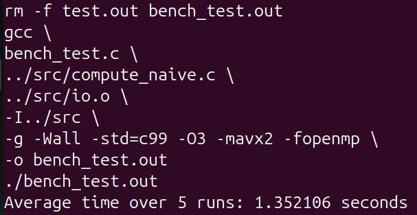
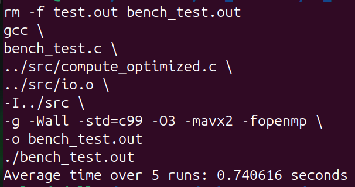

# Computer Architecture CEP: OpenMP Project

## Group 6

This repository contains our implementation of the **CS61C Project 4 (OpenMP Optimization)** originally designed by the **University of California, Berkeley**.

The project focuses on optimizing matrix convolution operations using **OpenMP** and comparing the performance of a baseline implementation against a parallelized implementation.

Original Project Reference:

https://web.archive.org/web/20241212231541/https:/cs61c.org/fa24/projects/proj4/#task-2-optimization

---

# Project Background

The original CS61C project is designed to be executed and evaluated on Berkeley's **Hive machines**, which provide the official testing and benchmarking environment.

Since we did not have access to the Hive infrastructure, we developed our own local testing and benchmarking framework to verify:

* Correctness of implementations
* Performance improvements obtained through OpenMP parallelization

To accomplish this, we created the following custom test programs:

* `test_driver.c` → Accuracy and correctness testing
* `bench_test.c` → Performance benchmarking

---

# Linux Requirement

The original project provides an object file:

```text
io.o
```

This object file was compiled for Linux and is used by the testing framework.

Because of this dependency, the project must be executed on a Linux-based environment.

## Requirements

* Linux (Ubuntu recommended)
* GCC / G++
* OpenMP support (`-fopenmp`)
* Make

Example installation on Ubuntu:

```bash
sudo apt update
sudo apt install build-essential
```

---

# Directory Structure

```text
├── docs
├── local_tests
│   ├── bench_test.c
│   ├── Makefile
│   ├── test_driver.c
│   └── tests.h
├── README.md
├── .gitignore
└── src
    ├── compute.h
    ├── compute_naive.c
    ├── compute_optimized.c
    ├── io.h
    └── io.o
```

---

# Source Files

## compute_naive.c

Contains the baseline implementation of matrix convolution without OpenMP optimizations.

This version serves as the reference implementation for correctness and performance comparison.

## compute_optimized.c

Contains the optimized OpenMP implementation.

Various parallelization and optimization techniques are applied to improve execution speed while preserving correctness.

---

# Test Files

## test_driver.c

Used for correctness verification.

This program compares outputs and ensures that the optimized implementation produces the same results as the reference implementation.

## bench_test.c

Used for performance benchmarking.

This program measures execution time and helps evaluate the speedup achieved through OpenMP optimization.

---

# Running the Project

The project supports two modes:

* **run** → Correctness / Accuracy Testing
* **bench** → Performance Benchmarking

You can execute either the naive or optimized implementation.

---

## Accuracy Testing

### Run Naive Implementation

```bash
make run MODE=naive
```

Uses:

```text
compute_naive.c
+
test_driver.c
```

---

### Run Optimized Implementation

```bash
make run MODE=optimized
```

Uses:

```text
compute_optimized.c
+
test_driver.c
```

---

## Benchmarking

### Benchmark Naive Implementation

```bash
make bench MODE=naive
```

Uses:

```text
compute_naive.c
+
bench_test.c
```

#### Output

<p align="center">
  
</p>

---

### Benchmark Optimized Implementation

```bash
make bench MODE=optimized
```

Uses:

```text
compute_optimized.c
+
bench_test.c
```

#### Output

<p align="center">
  
</p>

---

## Speedup Achieved

The OpenMP implementation significantly improves performance by parallelizing the matrix convolution workload across multiple CPU cores.

Based on our benchmarking results, the optimized implementation achieves approximately **2–3× speedup** compared to the baseline sequential implementation while maintaining identical output correctness.

---

# Goal

The primary objective of this project is to:

1. Implement matrix convolution correctly.
2. Parallelize the computation using OpenMP.
3. Measure performance improvements.
4. Analyze speedup achieved relative to the baseline implementation.

---

# Acknowledgements

This project is based on **CS61C Project 4: OpenMP Optimization** developed by the University of California, Berkeley.

The testing and benchmarking infrastructure included in this repository was developed locally to provide functionality similar to Berkeley's Hive environment.

---

**Computer Architecture CEP: OpenMP Project**
**Group 6**
