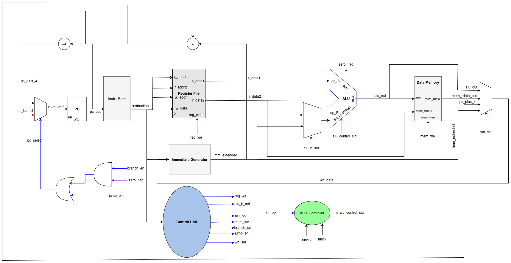

# CA-2026
# Single-Cycle CPU



A simple single-cycle CPU written in SystemVerilog for learning and simulation.

## Project Structure

- `rtl/` – CPU source files
- `tb/` – Testbench
- `include/` – Header files
- `docs/` – Documentation and Diagrams
- `build/` – Simulation outputs

## Run

```bash
make
```

## Files

- `single_cycle.sv` – Top module
- `alu.sv` – ALU
- `reg_file.sv` – Register file
- `instr_mem.sv` – Instruction memory
- `data_mem.sv` – Data memory
- `main_controller.sv` – Control unit
- `pc.sv` – Program counter
